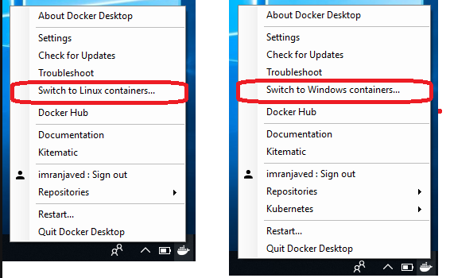

# Overview
OData driver implementation

# Running the service in Docker
These docker instructions and docker file is based off the following web publication `https://blog.alexellis.io/run-iis-asp-net-on-windows-10-with-docker/`
* To rebuild the docker image `docker build -f Dockerfile -t odatadriver:restierv2 .`
* To run the docker image `docker-compose up`

## Windows 10
* If you get the message `failed to solve with frontend dockerfile.v0: failed to build LLB` - disable buildkit by turning it off in Docker Desktop `Settings -> Docker Engine -> buildkit = false`
* If you get `no matching manifest for linux/amd64 in the manifest list entries` - Switch to Windows Containers

Refer to https://stackoverflow.com/questions/48066994/docker-no-matching-manifest-for-windows-amd64-in-the-manifest-list-entries